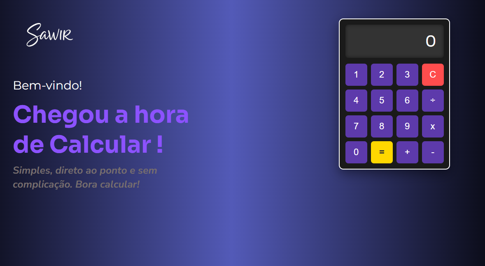

# SawirLator - Calculadora Web Funcional

Este repositório contém o código-fonte da **SawirLator**, uma aplicação web de calculadora desenvolvida com HTML, CSS e JavaScript puro. O projeto apresenta uma interface moderna e funcionalidades robustas para uma experiência de usuário fluida e intuitiva.

## ✨ Principais Características

* **Interface Gráfica Atraente:** Design com um gradiente suave, tipografia moderna importada do Google Fonts e um layout bem estruturado.
* **Operações Básicas:** Suporte completo para adição, subtração, multiplicação e divisão.
* **Tratamento de Erros:** Exibe uma mensagem de "Erro" no visor em casos de divisão por zero, evitando a quebra da aplicação.
* **Display Inteligente:** O visor se ajusta para exibir números longos em notação científica, prevenindo que o layout seja comprometido.
* **Precisão Decimal:** Implementa uma função para corrigir as imprecisões de ponto flutuante comuns em JavaScript.
* **Lógica Eficiente:** Utiliza o padrão de "Event Delegation" em JavaScript para otimizar a performance, gerenciando todos os cliques com um único `event listener`.

## 🛠️ Tecnologias Utilizadas

* HTML5
* CSS3
* JavaScript (ES6+)

## 🚀 Como Executar

1.  Clone este repositório para a sua máquina local.
2.  Abra o arquivo em qualquer navegador web moderno.

### 📸 Screenshot do Projeto

